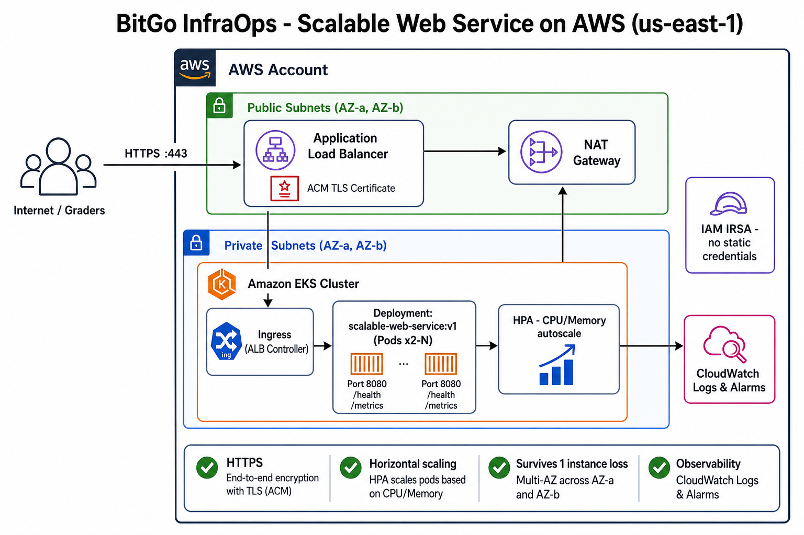
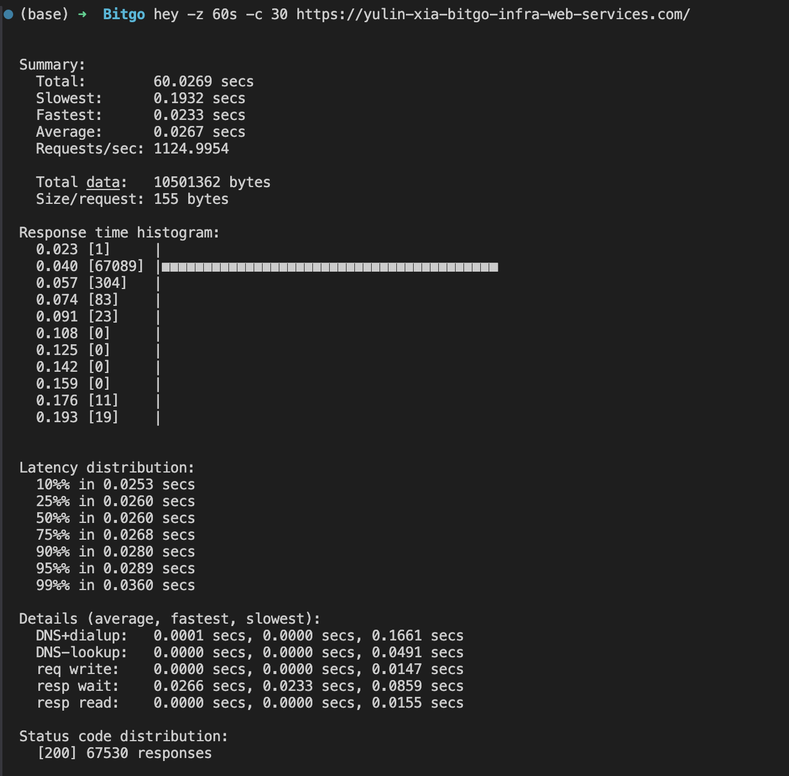
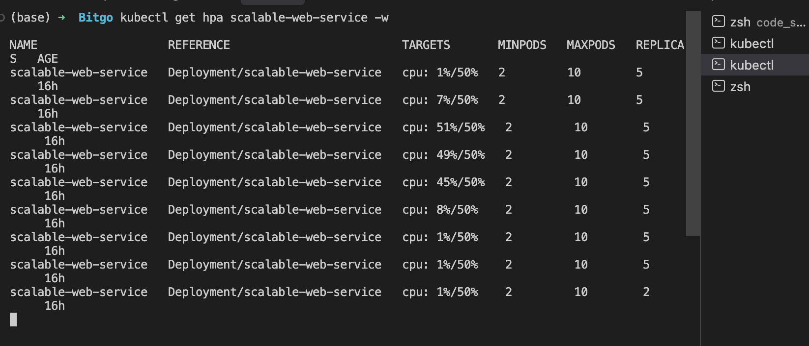
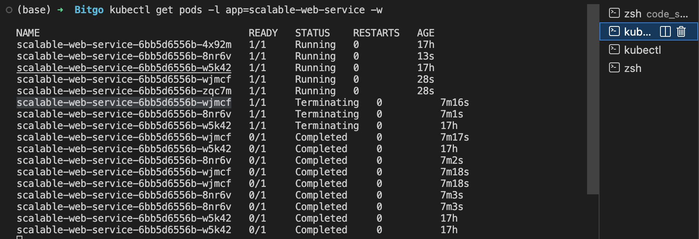
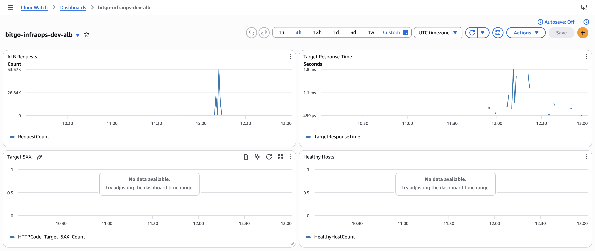
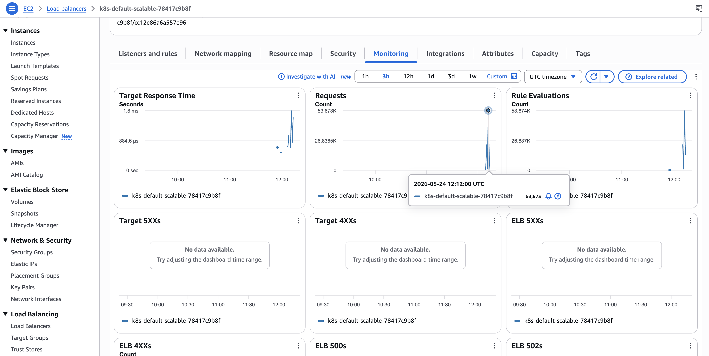

# BitGo InfraOps — Scalable Web Service on AWS

**Live URL:** https://yulin-xia-bitgo-infra-web-services.com  
**Health:** https://yulin-xia-bitgo-infra-web-services.com/health · **Metrics:** https://yulin-xia-bitgo-infra-web-services.com/metrics

| | |
|--|--|
| **Region** | `us-east-1` |
| **EKS cluster** | `bitgo-infraops-dev` |
| **App image** | `ghcr.io/therealdwright/scalable-web-service:v1` |
| **Domain** | `yulin-xia-bitgo-infra-web-services.com` (Route53) |
| **ACM** | Issued · used on ALB HTTPS listener |

---

## Architecture



**Traffic:** Internet → **Route53** (apex alias) → **ALB** (HTTPS, ACM) → **Ingress** (AWS LB Controller) → **Service** `:8080` → **Pods** on EKS worker nodes in **private subnets (2 AZs)**. Outbound image pull via **NAT**.

Detail: [`docs/architecture.md`](docs/architecture.md) · Full deploy guide: [`docs/GETTING_STARTED.md`](docs/GETTING_STARTED.md)

---

## PDF requirements → how this repo satisfies them

| Requirement | Implementation |
|---------------|----------------|
| **HTTPS, public endpoint** | ACM cert + Ingress ALB + Route53 apex → live URL above |
| **Horizontal scale out/in** | HPA CPU 50% target, min 2 / max 10 pods (verified with `hey`) |
| **Survive one instance loss** | ≥2 replicas across 2 AZs; ALB `/health` drains bad targets |
| **Observability** | ALB CloudWatch metrics + Terraform dashboard `bitgo-infraops-dev-alb` + 5xx alarm; app `/metrics` |
| **Least-privilege IAM** | IRSA for LB Controller; no static AWS keys in app Deployment |
| **Infrastructure as Code** | Terraform modules + independent stacks (see below) |

---

## Repository layout

```text
code_space/
├── kubernetes/          # Deployment, Service, Ingress, HPA
├── terraform/
│   ├── modules/         # vpc, eks, lb-controller-irsa, route53-alias, acm-certificate, cloudwatch-alb
│   └── resources/       # One state per stack (workspace: dev)
│       ├── vpc/         # 2 AZ, public/private, NAT
│       ├── eks/         # Cluster + node group (min 2 nodes)
│       ├── alb/         # IRSA for AWS Load Balancer Controller
│       ├── route53/     # Apex A (alias) → Ingress ALB
│       ├── acm/         # TLS certificate (imported from console)
│       └── cloudwatch/  # ALB dashboard + Target 5xx alarm
└── docs/                # Architecture, observability, screenshots
```

---

## Deploy order

Use workspace **`dev`** in each stack. See [`terraform/resources/README.md`](terraform/resources/README.md).

| Step | Command / action |
|------|------------------|
| 1 | `terraform apply` in `resources/vpc` |
| 2 | `terraform apply` in `resources/eks` → `aws eks update-kubeconfig --name bitgo-infraops-dev --profile bitgo` |
| 3 | `terraform apply` in `resources/alb` |
| 4 | Helm: install `aws-load-balancer-controller` (see `resources/alb/README.md`) |
| 5 | `kubectl apply -f kubernetes/` (deployment, service, ingress, hpa) |
| 6 | `resources/route53` — apex alias to ALB DNS ([`IMPORT.md`](terraform/resources/route53/IMPORT.md) if zone/record exist) |
| 7 | `resources/acm` — cert for domain ([`IMPORT.md`](terraform/resources/acm/IMPORT.md)) |
| 8 | `resources/cloudwatch` — `terraform apply` (ALB metrics dashboard + 5xx alarm) |

**Kubernetes manifests**

| File | Purpose |
|------|---------|
| `deployment.yaml` | 2 replicas, probes on `/health`, CPU requests for HPA |
| `service.yaml` | ClusterIP `:8080` |
| `ingress.yaml` | Internet-facing ALB, ACM ARN, SSL redirect |
| `hpa.yaml` | CPU 50%, min 2, max 10 |

---

## Autoscaling (verified)

| Setting | Value |
|---------|--------|
| Metric | CPU vs `requests.cpu` (100m per pod) |
| Target | 50% average utilization |
| Range | 2–10 replicas |

**Load test:** `hey -z 60s -c 30 https://yulin-xia-bitgo-infra-web-services.com/` → **67,530 requests, all HTTP 200** (~1,125 RPS). HPA scaled **2 → 5** pods when CPU exceeded 50%; scaled back to **2** after load dropped.





```bash
kubectl get hpa scalable-web-service
kubectl get pods -l app=scalable-web-service -o wide
```

---

## High availability

- Deployment `minReplicas: 2`; HPA floor `minReplicas: 2`
- Pods scheduled on nodes in **two AZs** (`10.0.10.x` / `10.0.11.x`)
- ALB target group health check: **`/health`** on port 8080

---

## Observability

| Layer | What |
|-------|------|
| **ALB** | CloudWatch metrics (EC2 console + dashboard below) |
| **App** | `GET /metrics` — Prometheus format (request count, latency, CPU/memory) |
| **EKS** | Control plane logs to CloudWatch (`api`, `audit`) via Terraform |
| **Terraform** | `resources/cloudwatch` — dashboard **`bitgo-infraops-dev-alb`** + alarm on `HTTPCode_Target_5XX_Count` |




More detail: [`docs/OBSERVABILITY.md`](docs/OBSERVABILITY.md)

---

## IAM (least privilege)

| Component | Access model |
|-----------|----------------|
| **App pods** | No AWS credentials in manifest |
| **AWS Load Balancer Controller** | **IRSA** — role `bitgo-infraops-dev-aws-lbc`, trust `kube-system:aws-load-balancer-controller` |
| **EKS nodes** | Managed node instance profile |
| **Human/Terraform** | IAM user `bitgo` profile (interview account; production would narrow policies) |

---

## Design choices (interview talking points)

| Choice | Why |
|--------|-----|
| **EKS** | Native HPA, multi-replica HA, matches InfraOps/Kubernetes focus |
| **ALB + Ingress** | PDF HTTPS, built-in health checks, integrates with ACM |
| **Private nodes + NAT** | Smaller attack surface; nodes not directly internet-facing |
| **Separate Terraform stacks** | Independent state per domain (vpc / eks / dns / observability); parallel ownership |
| **CPU-only HPA** | Simple, sufficient for provided app; memory HPA optional |

---

## If I had another week

- **Cluster Autoscaler** (scale EC2 when pods cannot schedule)
- **WAF** on ALB
- **S3 remote Terraform state** + DynamoDB lock (enable commented `_backend.tf` blocks)
- **Tighten IAM** — replace broad admin with scoped policies for CI/terraform roles
- **GitOps / CI** pipeline for `kubectl apply` (out of scope for this exercise)

---

## Cut for time

- **Domain registration** done in Route53 console first; DNS record + ACM **imported** into Terraform (`IMPORT.md`) rather than greenfield apply
- **Container Insights / AMP** — used ALB CloudWatch dashboard + app `/metrics` instead of full pod-level Prometheus on AWS
- **Cluster Autoscaler** — fixed node group 2–4; pod scaling only via HPA

---

## Teardown (avoid ongoing charges)

```bash
kubectl delete ingress scalable-web-service    # removes ALB
# destroy stacks (reverse dependency order), workspace dev:
# cloudwatch → acm → route53 → alb → eks → vpc
```

Disable Route53 domain auto-renew if the domain is no longer needed. Keep AWS billing receipts for reimbursement.

---

## Author

Yulin Xia — Fall 2026 BitGo InfraOps internship submission.
