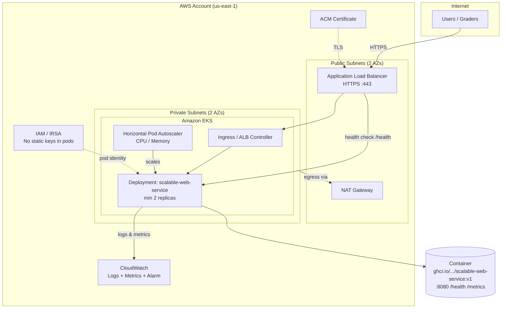
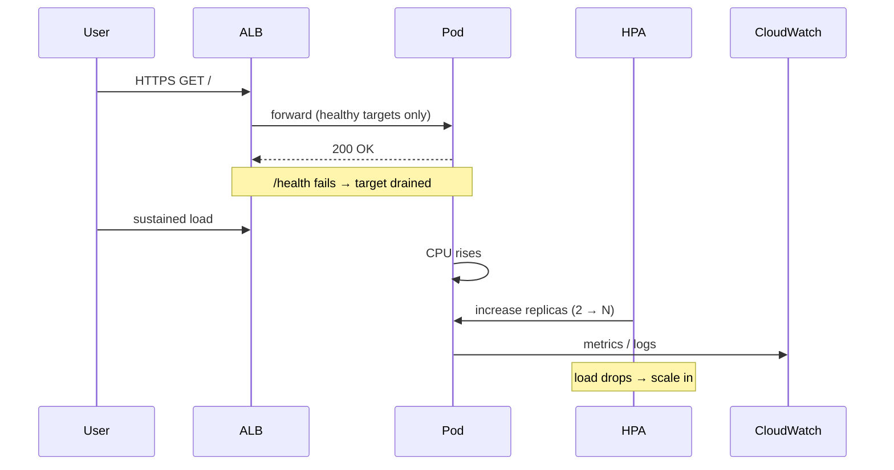

# Architecture — BitGo InfraOps Assessment

## High-level diagram (Mermaid)

## Traffic & scaling flow

## Design decisions (for README & interview)

| Decision | Choice | Why |
|----------|--------|-----|
| Compute | EKS + managed node group | Matches InfraOps/K8s; easy HPA; multi-replica HA |
| Entry | ALB + ACM | PDF requires HTTPS; native health checks |
| Network | Private subnets for nodes/pods | Reduce attack surface; egress via NAT |
| HA | ≥2 replicas, 2 AZs | Survives loss of one instance/node |
| Scaling | HPA on CPU (and/or memory) | App exposes `/metrics`; CPU HPA is enough for PDF |
| Observability | CloudWatch + ALB metrics | Meets “at least one”; fast to implement |
| IAM | IRSA for workloads | Least privilege; no keys in Deployment |
| Out of scope | CI/CD, multi-region, DB | Per PDF — document in README |

## What graders will test

1. `https://<your-url>/` — works
2. `https://<your-url>/health` — healthy
3. Load spike → replica count increases → decreases after load stops
4. Kill one pod → endpoint still works
5. Terraform repo explains VPC, EKS, ALB, scaling, IAM
